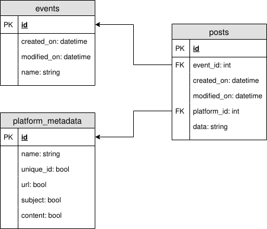

# Database model

The above picture shows the Entity Relationship diagram. Here's how the sample data would look like:

### events
|id|created_on|modified_on|name|
|--|--|--|--|
|1|2020-07-03 14:02:53|2020-07-03 14:02:53|March Meetup|

### platform_metadata
|id|name|unique_id|url|subject|content|
|--|--|--|--|--|--|
|1|Facebook|1|1|0|1|
|2|Twitter|1|1|0|1|
|3|Telegram|0|0|0|1|
|4|Mail|1|0|1|1|

### posts
|id|event_id|created_on|modified_on|platform_id|data|
|--|--|--|--|--|--|
|1|1|2020-07-03 14:03:53|2020-07-03 14:03:53|1|{"unique_id": 1313, "url": "fb.com/posts/12312", "content": "this is a post"}|
|2|1|2020-07-03 14:03:54|2020-07-03 14:03:54|4|{"unique_id": 213213, "subject": "March Meetup Mail", "content": "Howdie!"}|
