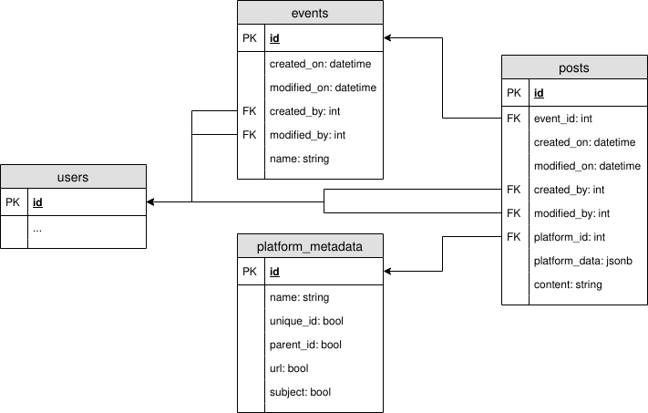

# Database model

The above picture shows the Entity Relationship diagram. Here's how the sample data would look like:

### events
|id|created_on|modified_on|created_by|modified_by|name|
|--|--|--|--|--|--|
|1|2020-07-03 14:02:53|2020-07-03 14:02:53|1|2|March Meetup|

### platform_metadata
|id|name|unique_id|parent_id|url|subject|
|--|--|--|--|--|--|
|1|Facebook|1|1|1|0|
|2|Twitter|1|1|1|0|
|3|Telegram|0|0|0|0|
|4|Mail|1|0|0|1|

\*The platform metadata table is to declare a structure for any platform's content. 

### posts
|id|event_id|created_on|modified_on|created_by|modified_by|platform_id|platform_data|content|
|--|--|--|--|--|--|--|--|--|
|1|1|2020-07-03 14:03:53|2020-07-03 14:03:53|1|1|1|{"unique_id": 1313, "url": "fb.com/posts/12312"}|this is a post|
|2|1|2020-07-03 14:03:54|2020-07-03 14:03:54|2|2|4|{"unique_id": 213213, "subject": "March Meetup Mail"}|Howdie!|
|3|1|2020-07-03 14:05:54|2020-07-03 14:05:54|1|1|1|{"unique_id": 1314, "parent_id": 1313, "url": "fb.com/comments/123121314"}|this is a comment!|
